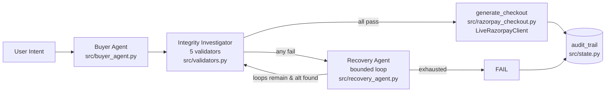

# ◆ Transaction Integrity Agent

### Every money action: **explainable**, **bounded**, **gated**.

> A strict cashier between an AI shopping assistant and your money. The AI can suggest — but only five deterministic checks can say **yes** to a payment. Every step is written to an append-only audit trail. Built for **Track 01: AI Growth & Agentic Commerce**.

[](https://www.python.org/)
[](https://fastapi.tiangolo.com/)
[](https://langchain-ai.github.io/langgraph/)
[](https://razorpay.com/docs/api/payment-links/)
[](LICENSE)

---

### The Hook — Why This Exists

> *“Three days ago, Claude, ChatGPT and Grok — the models powering a lot of shopping assistants — all went down at once, for hours. If an AI agent needs one of those to decide whether it’s safe to charge your card, that outage becomes a broken checkout. We built something that doesn’t have that problem.”*

Normal agentic commerce = LLM decides to charge. Ours = LLM **proposes**, deterministic code **disposes**. No LLM call sits on the money path — so an LLM outage cannot become a payment outage.

---

## What It Does — Plainly

```
User: "one book under ₹3000"
  │
  ▼
[ AI Buyer proposes ] ──► [ 5 Deterministic Validators ] ──► [ PASS → real Razorpay link / FAIL → exact reason ]
                                   │
                                   └─► every step → audit_trail[]
```

Think of a strict cashier between the AI and your wallet:

1. **Is the price right?** — catalog price vs checkout price must match
2. **Is it in stock?** — requested quantity ≤ verified stock
3. **Does the policy make sense?** — fine-print exclusions honoured
4. **Is it in budget?** — final amount ≤ your stated max
5. **Does it match what you asked?** — quantity and budget intent alignment

Only if **all five pass** does `generate_checkout` mint a real Razorpay test-mode `short_url` (`https://rzp.io/rzp/...`). If any fails → `DECISION: FAIL`, no payment attempted, `failure_reason` tells why. Every transition is `append_audit`’d — **the audit trail is the product.**

---

## Architecture



**Core law — enforced in Pydantic:** `src/state.py:122` `_enforce_core_design_law`

* `is_violation_detected == True` ⟺ at least one validator failed
* `final_decision == PASS` ⟺ all validators passed AND no violation
* Only deterministic code may set `PASS`/`FAIL` — extra fields `forbid`, `validate_assignment=True`

**State — single source of truth `src/state.py:68`:**

`TransactionState` holds `user_intent`, `max_budget`, `catalog_record`, `inventory_record`, `checkout_record`, `policy_record`, `validation_results`, `audit_trail`, `loop_count/MAX_LOOPS=3`, `tried_product_ids`, `final_decision`, `checkout_link`, `failure_reason`.

**Graph — `src/graph.py:19` LangGraph `StateGraph`:**
`buyer_agent → integrity_investigator → (generate_checkout | recovery_agent) → (END | integrity_investigator)` with injected `RazorpayClient` dependency. Sync `compiled.invoke(initial_state)` — frontend stages `300ms` client-side, no streaming risk.

---

## Why Track 01 — Growth + Discoverability

**Growth:** Recovery is not a side effect — it’s revenue. Bounded `MAX_LOOPS=3` on `tried_product_ids` exclusion. In full-pipeline tests, **117/120** `invalid` scenarios that hit a real problem (price/stock) still completed via a *different valid* product in same category/budget and passed all five re-checks — safely, because the same validators gate the alternative. Near-misses → revenue.

**Discoverability:** Small merchants don’t need a website to sell to AIs.

* `GET /catalog` `src/api.py:187` — full 120-item synthetic catalog `src/catalog.py:31` (10 categories: electronics, clothing, books, home, sports, beauty, toys, automotive, grocery, health — 12 each, seeded `Random(42)`), as `[{product_id,name,price,currency,category}]` read-only, no pagination, detached copies.
* `GET /.well-known/agent.json` `src/api.py:211` — honest descriptor any AI can fetch:
  ```json
  {
    "name": "Transaction Integrity Agent — Demo Merchant",
    "description": "Demo merchant ... exposes a read-only synthetic catalog and a bounded transaction endpoint with deterministic validation and full audit trail.",
    "catalog_url": "http://localhost:8000/catalog",
    "transact_url": "http://localhost:8000/transact",
    "transact_method": "POST",
    "transact_schema": {"user_intent": "string", "force_stockout_first": "boolean (optional, demo only)"},
    "capabilities": ["catalog_discovery","bounded_transaction","audit_trail"]
  }
  ```
  No false UCP/ACP/AP2 claim — only what exists.

---

## Live Demo — Dark Terminal Dashboard

`frontend/index.html` — **single file, no framework, no CDN, system `ui-monospace` only, works `file://` offline.**

* **Header:** `◆ TXN INTEGRITY — DEMO MERCHANT` + *“the audit trail is the product”*
* **Card 1 — Request:** `one book under ₹3000` input + pill toggle `Force first candidate out of stock` (still plain `input[type=checkbox]#forceToggle` under hood, `appearance:none` switch) + `Submit → Run Agent` teal `#14b8a6` + hint `POST http://localhost:8000/transact`
* **Card 2 — Audit Trail — Terminal:** `min-height:160px`, `max-height:380px`, scanline `repeating-linear-gradient`, per-line `border-left:3px`. `VIOLATION` amber, `FALLBACK` purple, `NOTE` muted, `DECISION` teal, each entry `opacity:0 → .visible` `220ms` triggered by `requestAnimationFrame` on `appendChild` — timing still driven by `REVEAL_MS=300`
* **Card 3 — Result:** `PASS` teal glow `box-shadow:0 0 28px rgba(20,184,166,0.18)` + `https://rzp.io/rzp/...` clickable vs `FAIL` muted red + `failure_reason`

**One request, staged reveal:** `fetch POST /transact` → full `audit_trail` JSON at once → client reveals one entry per `300ms`. Keep Network tab open to prove it.

---

## API Reference

| Method | Path | Description | Success |
|--------|------|-------------|---------|
| `GET` | `/` | `{"status":"ok"}` | 200 |
| `GET` | `/health` | health | 200 |
| `GET` | `/catalog` | 120 products, read-only | 200 `json array` |
| `GET` | `/.well-known/agent.json` | merchant descriptor | 200 `json` |
| `POST` | `/transact` | `{user_intent, force_stockout_first?}` | 200 `{final_decision,audit_trail,checkout_link,razorpay_mode}` |

**POST /transact body:**
```json
{
  "user_intent": "one book under 3000",
  "force_stockout_first": false
}
```

**Response (PASS):**
```json
{
  "final_decision": "PASS",
  "checkout_link": "https://rzp.io/rzp/JBl3n7F",
  "razorpay_mode": "live",
  "audit_trail": [
    "Buyer Agent: picked 'Fiction Novel 13' (category=books, price=₹274.30, budget=₹3000.00) ...",
    "generate_checkout: creating payment link for ₹323.67 (32367 paise) — Payment for Fiction Novel 13",
    "generate_checkout: Razorpay link created — id=plink_... short_url=https://rzp.io/rzp/...",
    "DECISION: PASS — all validators passed, checkout link generated"
  ]
}
```

**Response (recovery PASS — with `force_stockout_first:true`):**
```json
[
  "Buyer Agent: picked 'Fiction Novel 13' ...",
  "VIOLATION: InventoryValidator: Insufficient stock: requested 1, available 0",
  "LOOP: attempt 1/3",
  "Recovery Agent: found alternative 'Fiction Novel 43' (price=₹838.12, attempt #1/3) ...",
  "generate_checkout: Razorpay link created — id=plink_... short_url=https://rzp.io/rzp/...",
  "DECISION: PASS — all validators passed, checkout link generated"
]
```

**Fallback (missing keys / limit / network):** returns same `PASS` but `checkout_link: https://stub.example.com/plink/...` + prepended `FALLBACK: LiveRazorpayClient ... — using StubRazorpayClient` and appended `NOTE:` — stub never masks as live (`src/api.py:109` `_inject_fallback_audit`).

---

## Quick Start

**1. Clone & install (Python 3.11+):**
```bash
git clone https://github.com/kadv19/RazorPay-Advaith.git
cd RazorPay-Advaith
python -m venv venv && source venv/bin/activate  # Windows: venv\Scripts\activate
pip install -e .          # or: pip install -r <(grep -A 20 dependencies pyproject.toml)
```

**2. Env (live Razorpay test-mode):**
```bash
cp .env.example .env  # create if missing
# edit .env:
RAZORPAY_KEY_ID=rzp_test_XXXXXXXXXXXX
RAZORPAY_KEY_SECRET=XXXXXXXXXXXXXXXXXXXX
# Get test keys: https://dashboard.razorpay.com/app/keys
# If empty/missing, API auto-falls back to stub — demo won’t crash.
```

**3. Backend:**
```bash
./venv/bin/python -m uvicorn src.api:app --reload --port 8000 --host 127.0.0.1
# → http://127.0.0.1:8000  docs: http://127.0.0.1:8000/docs
curl http://localhost:8000/health
curl http://localhost:8000/catalog | python -m json.tool | head -20   # 120
curl http://localhost:8000/.well-known/agent.json | python -m json.tool
curl -X POST http://localhost:8000/transact -H "Content-Type: application/json" \
  -d '{"user_intent":"one book under 3000"}' | python -m json.tool
```

**4. Frontend:**
```bash
# Option A — fastest, offline:
open frontend/index.html  # file://

# Option B — serve (better Network tab):
python -m http.server 5173 --directory frontend
# → http://localhost:5173
```

**5. CLI demo (no browser):**
```bash
python run_demo.py "one book under 3000"
python run_demo.py "one book under 3000" --force-stockout-first
```

---

## Verification — Proof, Not Claims

**Validator-only (Phase 1):** `data/benchmark_report.json` — 180 scenarios (60 valid / 120 invalid across 6 categories: price mismatch, inventory, policy, budget, combined) → `precision 1.0, recall 1.0, invalid_marked_pass 0` per validator `tp 30-38 fp 0 fn 0`.

**Routing safety (Phase 3):** `benchmarks/full_benchmark_report.json` `safety_invariant_check` via `StubRazorpayClient` call log:
* `invalid_final_state_reached_checkout: 0` — no failing validator ever reached checkout
* `fail_but_checkout_bug: 0` — no `FAIL` ever minted a link
* `amount_conversion_correct: true` — `round(final_amount*100)` correct
* `stub_total_calls: 174`, `total_pass 174, total_fail 6`

**Agent behavior gap (honest framing):** `agent_behavior_gap` `117/120` category substitution — `buyer_agent` `src/catalog.py:203` cheapest-valid search ignores `scenarios.json` injected records and finds a *different valid* product in same category/budget that passes re-validation. Documented as `does_prove / does_not_prove` — not a safety miss.

**Raw audit_trail:** every `POST /transact` returns `audit_trail: string[]` you can `python -m json.tool` full-screen per script `2:15–2:45`.

---

## Project Structure

```
.
├── src/
│   ├── state.py               # CORE DESIGN LAW, TransactionState, audit_trail
│   ├── catalog.py             # 120-item seeded catalog, _find_candidate, _extract_category/budget
│   ├── validators.py          # 5 pure validators + run_all_validators
│   ├── buyer_agent.py         # intent → candidate, tried_product_ids
│   ├── integrity_investigator.py # runs validators, marks violations
│   ├── recovery_agent.py      # bounded MAX_LOOPS=3, alternative search
│   ├── razorpay_checkout.py   # round(final*100), real id/short_url logging
│   ├── razorpay_client.py     # LiveRazorpayClient / StubRazorpayClient DI
│   ├── graph.py               # LangGraph StateGraph wiring
│   └── api.py                 # FastAPI: POST /transact, GET /catalog, GET /.well-known/agent.json
├── frontend/
│   └── index.html             # single-file dark dashboard, staged 300ms reveal, no CDN
├── data/
│   ├── scenarios.json         # 180 scenarios
│   └── benchmark_report.json  # Phase 1 1.0/1.0
├── benchmarks/
│   ├── run_benchmark.py
│   ├── run_full_benchmark.py
│   └── full_benchmark_report.json # Phase 3 0/0 safety
├── docs/demo_script.md        # 90s verbatim script
├── run_demo.py
├── pyproject.toml
└── .env                       # .gitignore, not committed
```

---

## Configuration

| Key | Required | Description |
|-----|----------|-------------|
| `RAZORPAY_KEY_ID` | for live link | Razorpay test Key ID `rzp_test_...` |
| `RAZORPAY_KEY_SECRET` | for live link | Razorpay test Secret |

Test-mode limit: Razorpay caps `payment_link` at 30 in test. Our code cancels after demo, but dashboard `Cancelled` still counts — create a fresh test account if you hit `RATE_LIMIT_EXCEEDED`. Stub fallback keeps demo honest regardless.

---

## Phases — How It Was Built

* **Phase 1 — Deterministic core:** `src/state.py` + `src/validators.py` + `data/scenarios.json` — benchmark before agents.
* **Phase 2 — Agentic orchestration:** `src/catalog.py` + `src/buyer_agent.py` + `src/recovery_agent.py` + `src/graph.py` — bounded recovery loop + synthetic catalog.
* **Phase 3 — Safety benchmark:** `benchmarks/run_full_benchmark.py` → 0/0 invariants, gap docs.
* **Phase 4 — Live demo:** `src/api.py` live→stub, `frontend/index.html` staged reveal, `docs/demo_script.md`.
* **Track 01 — Catalog discoverability:** `GET /catalog` + `GET /.well-known/agent.json`.

Every phase was benchmarked before the next — nothing is a black box.

---

## Honest Scope

* Prototype `Trust Dashboard` + `opportunity network` (cross-merchant, strict consent) were **held back** — prototyped on `feature/phase10-trust-dashboard` but not merged to keep the submission fully verified.
* No false UCP/ACP/AP2 compliance — descriptor `src/api.py:213` says only what exists.
* LLM is **advisory only** — it never decides `PASS`/`FAIL`.

---

## License

MIT — see `LICENSE`.

---

> **Try it now:** `curl http://localhost:8000/catalog | head` → 120 products. `curl http://localhost:8000/.well-known/agent.json | python -m json.tool` → discoverable merchant. `POST /transact` → every money action explainable, bounded, gated — and it would have kept running through the outage.
